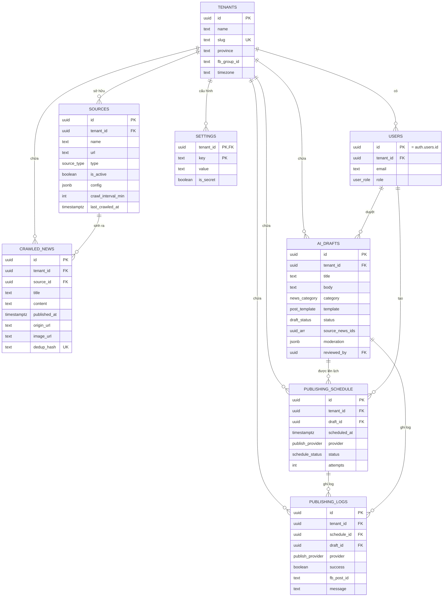

# ERD — Sơ đồ quan hệ thực thể

Điểm thiết kế chính:
- **`tenant_id` ở mọi bảng** → sẵn sàng SaaS đa xã/phường, cô lập dữ liệu bằng RLS.
- **`dedup_hash` unique theo tenant** → chống trùng lặp tin ở tầng DB.
- **`ai_drafts.status`** là trục vòng đời: `generated → pending → approved/rejected → scheduled → published/failed`.
- **`publishing_schedule` + `publishing_logs`** tách lịch và lịch sử để audit & retry.
